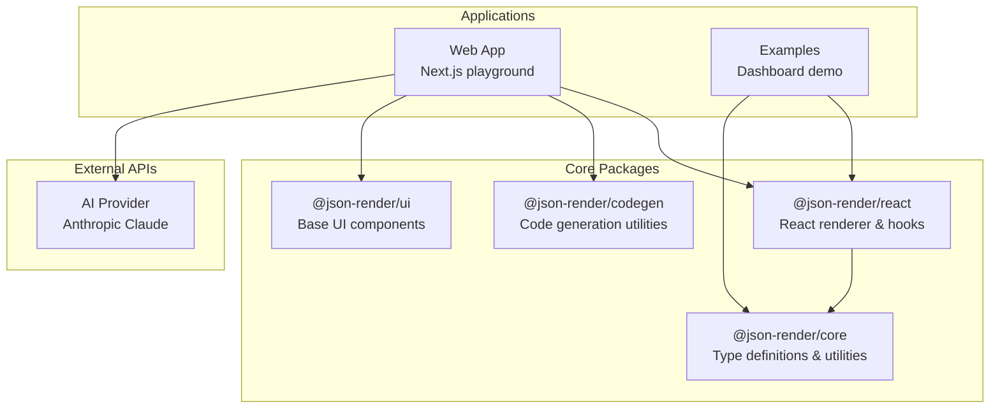
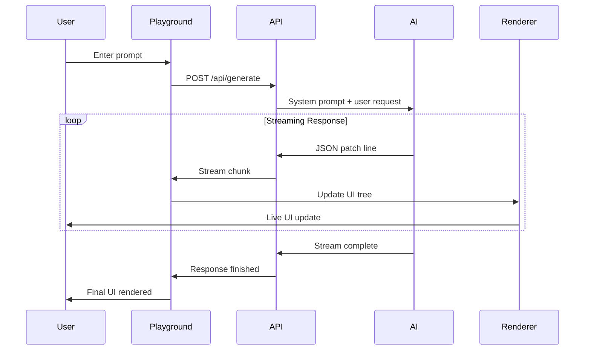

# AI JSON Render System Overview

## Introduction

The AI JSON Render system is a sophisticated framework that enables AI to generate dynamic user interfaces through structured JSON output. The system transforms AI-generated JSON patches into live React components, creating a bridge between language models and interactive UI development.

## Core Architecture

The system is built as a monorepo with four primary packages and a demonstration web application:



## Key Features

### 🎯 **AI-First Design**
- Optimized system prompts for UI generation
- JSON Lines (JSONL) streaming support for real-time updates
- Patch-based incremental updates
- Context-aware iteration support

### 🔄 **Real-time Streaming**
- WebSocket-like streaming via Server-Sent Events
- Incremental UI updates as JSON patches arrive
- Live preview during generation

### 🧩 **Component System**
- Type-safe component definitions with Zod schemas
- Dynamic prop resolution with data binding
- Hierarchical component tree structure
- 22 built-in UI components

### 📊 **Data Management**
- Dynamic value binding to external data sources
- Context-aware visibility conditions
- Action system for user interactions
- Form state management

## Package Structure

| Package | Purpose | Key Files |
|---------|---------|-----------|
| `@json-render/core` | Core types and utilities | [`packages/core/src/types.ts`](../packages/core/src/types.ts) |
| `@json-render/react` | React integration layer | [`packages/react/src/renderer.tsx`](../packages/react/src/renderer.tsx) |
| `@json-render/codegen` | Code generation tools | [`packages/codegen/src/serialize.ts`](../packages/codegen/src/serialize.ts) |
| `@json-render/ui` | Base UI components | [`packages/ui/src/`](../packages/ui/src/) |

## Data Flow



## File Structure

```
ai-json-render/
├── packages/
│   ├── core/           # Core type system and utilities
│   ├── react/          # React integration and renderer
│   ├── codegen/        # Code generation utilities  
│   └── ui/             # Base UI component library
├── apps/
│   ├── web/            # Main playground application
│   └── examples/       # Example applications
└── docs/
    └── dev/            # Technical documentation
```

## Technology Stack

- **Language**: TypeScript 5.9+
- **Framework**: React 18+ with Next.js 14+
- **Validation**: Zod for runtime type safety
- **Styling**: Tailwind CSS with shadcn/ui components
- **Build System**: Turbo for monorepo management
- **Package Manager**: bun with workspaces
- **AI Integration**: Vercel AI SDK with Anthropic provider

## Getting Started

1. **Clone and Install**
   ```bash
   git clone <repository>
   cd ai-json-render
   bun install
   ```

2. **Configure Environment**
   - Copy `.env.example` to `.env`
   - Add your Anthropic API key
   - Configure model preferences

3. **Start Development**
   ```bash
   bun dev
   ```

4. **Access Playground**
   - Navigate to http://localhost:3000/playground
   - Enter prompts to generate UIs
   - Iterate with additional requests

## Key Concepts

### UI Trees
UI structures are represented as flat trees with string-based references:

```typescript
interface UITree {
  root: string;              // Key of root element
  elements: Record<string, UIElement>; // Flat element storage
}
```

*Reference: [`packages/core/src/types.ts:85-89`](../packages/core/src/types.ts#L85-L89)*

### JSON Patches
Updates follow RFC 6902 JSON Patch specification:

```typescript
interface PatchOp {
  op: "add" | "set" | "remove";
  path: string;
  value?: any;
}
```

*Reference: [`packages/core/src/types.ts:140-144`](../packages/core/src/types.ts#L140-L144)*

### Component Registry
Components are registered with type-safe definitions:

```typescript
type ComponentRegistry = Record<string, ComponentRenderer<any>>;
```

*Reference: [`packages/react/src/renderer.tsx:34-34`](../packages/react/src/renderer.tsx#L34-L34)*

## Next Steps

- [🏗️ Architecture Deep Dive](./02-architecture.md)
- [🧩 Component System](./03-component-system.md) 
- [🔄 Data Flow & Streaming](./04-data-flow.md)
- [🚀 API Reference](./05-api-reference.md)