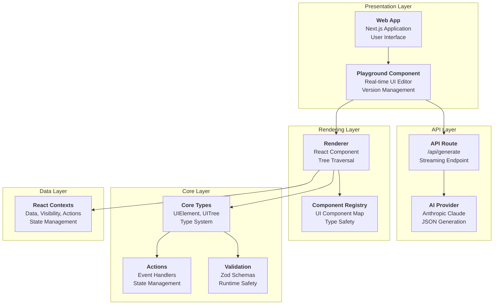
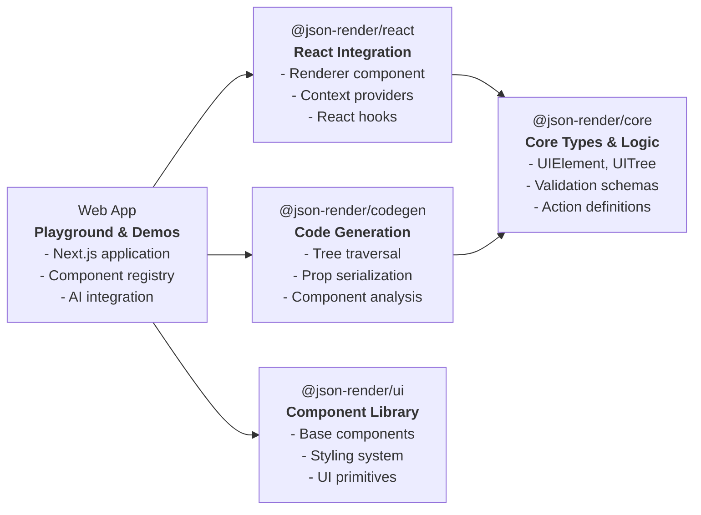
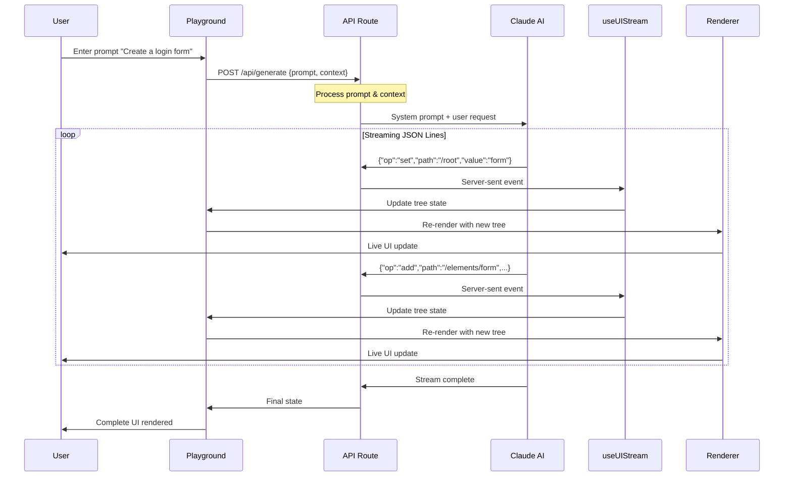
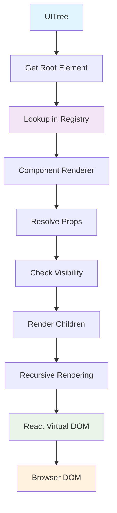

# Architecture Deep Dive

## System Architecture

The AI JSON Render system follows a layered architecture pattern with clear separation of concerns:



## Package Dependencies



## Core Abstractions

### 1. UIElement Structure

The fundamental building block is the `UIElement`:

```typescript
// From packages/core/src/types.ts:52-62
interface UIElement<T extends string = string, P = Record<string, unknown>> {
  key: string;           // Unique identifier for React reconciliation
  type: T;              // Component type from registry
  props: P;             // Component-specific properties
  children?: string[];  // Array of child element keys
  parentKey?: string | null; // Parent element key (null for root)
  visible?: VisibilityCondition; // Conditional visibility
}
```

*Key insights:*
- **Flat Structure**: Children are referenced by string keys, not nested objects
- **Type Safety**: Generic `T` constrains component types to registry
- **Reconciliation**: React keys enable efficient re-rendering
- **Hierarchy**: Parent-child relationships via keys

### 2. UITree Organization

The complete UI state is stored as a `UITree`:

```typescript
// From packages/core/src/types.ts:85-89  
interface UITree {
  root: string;                           // Key of root element
  elements: Record<string, UIElement>;    // Flat storage of all elements
}
```

**Benefits of flat structure:**
- Efficient element lookups by key
- Easy patch operations (add/update/remove by path)
- Simplified traversal algorithms
- Better memory usage patterns

### 3. Component Registry System

Components are registered with type-safe renderers:

```typescript
// From packages/react/src/renderer.tsx:34
type ComponentRegistry = Record<string, ComponentRenderer<any>>;

// From packages/react/src/renderer.tsx:21-26
interface ComponentRenderProps<P = Record<string, unknown>> {
  element: UIElement<string, P>;
  children?: ReactNode;
  onAction?: (action: Action) => void;
  loading?: boolean;
}
```

*Example registry creation:*

```typescript
// From apps/web/components/demo/index.ts:52-84
export const demoRegistry: ComponentRegistry = {
  Alert,
  Avatar,
  Badge,
  BarGraph,
  Button,
  Card,
  Checkbox,
  Divider,
  Form,
  Grid,
  Heading,
  Image,
  Input,
  LineGraph,
  Link,
  Progress,
  Radio,
  Rating,
  Select,
  Stack,
  Switch,
  Text,
  Textarea,
};

export const fallbackComponent: ComponentRenderer = Fallback;
```

## Data Flow Architecture

### 1. Request Flow



### 2. Component Rendering Flow



*Key rendering logic:*

```typescript
// From packages/react/src/renderer.tsx:58-78
function ElementRenderer({element, tree, registry, loading, fallback}) {
  const isVisible = useIsVisible(element.visible);
  const { execute } = useActions();

  if (!isVisible) return null;

  const Component = registry[element.type] ?? fallback;
  if (!Component) {
    console.warn(`No renderer for component type: ${element.type}`);
    return null;
  }

  const children = element.children?.map((childKey) => {
    const childElement = tree.elements[childKey];
    if (!childElement) return null;
    return (
      <ElementRenderer
        key={childKey}
        element={childElement}
        tree={tree}
        registry={registry}
        loading={loading}
        fallback={fallback}
      />
    );
  });

  return <Component element={element}>{children}</Component>;
}
```

## Context Management

The system uses multiple React contexts for state management:

### 1. Data Context
```typescript
// From packages/react/src/contexts/data.ts
interface DataContextValue {
  data: DataModel;
  updateData: (path: string, value: any) => void;
  bindToField: (path: string) => any;
}
```

### 2. Visibility Context  
```typescript
// From packages/react/src/contexts/visibility.ts
interface VisibilityContextValue {
  authState: AuthState;
  setAuthState: (state: AuthState) => void;
}
```

### 3. Action Context
```typescript
// From packages/react/src/contexts/actions.ts
interface ActionContextValue {
  execute: (action: Action) => Promise<void>;
  isExecuting: (actionId: string) => boolean;
  confirm: (config: ConfirmConfig) => Promise<boolean>;
}
```

### 4. Validation Context
```typescript  
// From packages/react/src/contexts/validation.ts
interface ValidationContextValue {
  mode: ValidationMode;
  setMode: (mode: ValidationMode) => void;
  errors: Record<string, string[]>;
  validate: (path: string, value: any) => string[];
}
```

## Streaming Architecture

### useUIStream Hook

The core streaming functionality is provided by `useUIStream`:

```typescript
// From packages/react/src/hooks.ts (inferred structure)
function useUIStream(options: {
  api: string;
  onError?: (error: Error) => void;
}) {
  const [tree, setTree] = useState<UITree | null>(null);
  const [isStreaming, setIsStreaming] = useState(false);
  
  const send = useCallback(async (prompt: string, context?: any) => {
    // Implementation handles:
    // 1. HTTP POST to API endpoint
    // 2. Streaming response parsing
    // 3. JSON patch application
    // 4. Tree state updates
  }, []);
  
  return { tree, isStreaming, send, clear };
}
```

### Patch Application

JSON patches are applied incrementally:

```typescript
// Conceptual patch application logic
function applyPatch(tree: UITree, patch: PatchOp): UITree {
  switch (patch.op) {
    case "set":
      return setByPath(tree, patch.path, patch.value);
    case "add": 
      return addByPath(tree, patch.path, patch.value);
    case "remove":
      return removeByPath(tree, patch.path);
  }
}
```

*Reference: JSON Patch operations in [`packages/core/src/types.ts:140-148`](../packages/core/src/types.ts#L140-L148)*

## Performance Optimizations

### 1. Flat Element Storage
- O(1) element lookups by key
- Efficient patch operations
- Minimal memory allocation during updates

### 2. React Reconciliation
- Stable keys prevent unnecessary re-renders  
- Component memoization opportunities
- Virtual DOM diffing optimizations

### 3. Lazy Loading
- Components loaded on-demand
- Registry supports dynamic imports
- Conditional rendering for visibility

### 4. Streaming Efficiency  
- Incremental UI updates
- Minimal JSON parsing overhead
- Real-time user feedback

## Error Handling

### 1. Component Fallbacks
```typescript
// Unknown component types render fallback
const Component = registry[element.type] ?? fallback;
```

### 2. Schema Validation
```typescript
// Zod schemas validate runtime data
const result = UIElementSchema.safeParse(data);
if (!result.success) {
  handleValidationError(result.error);
}
```

### 3. Stream Error Recovery
```typescript
// Stream errors are caught and reported
useUIStream({
  api: "/api/generate",
  onError: (error) => {
    console.error("Stream error:", error);
    toast.error("Generation failed");
  }
});
```

## Next Steps

- [🧩 Component System Details](./03-component-system.md)
- [🔄 Data Flow & Streaming](./04-data-flow.md)
- [🚀 API Reference](./05-api-reference.md)