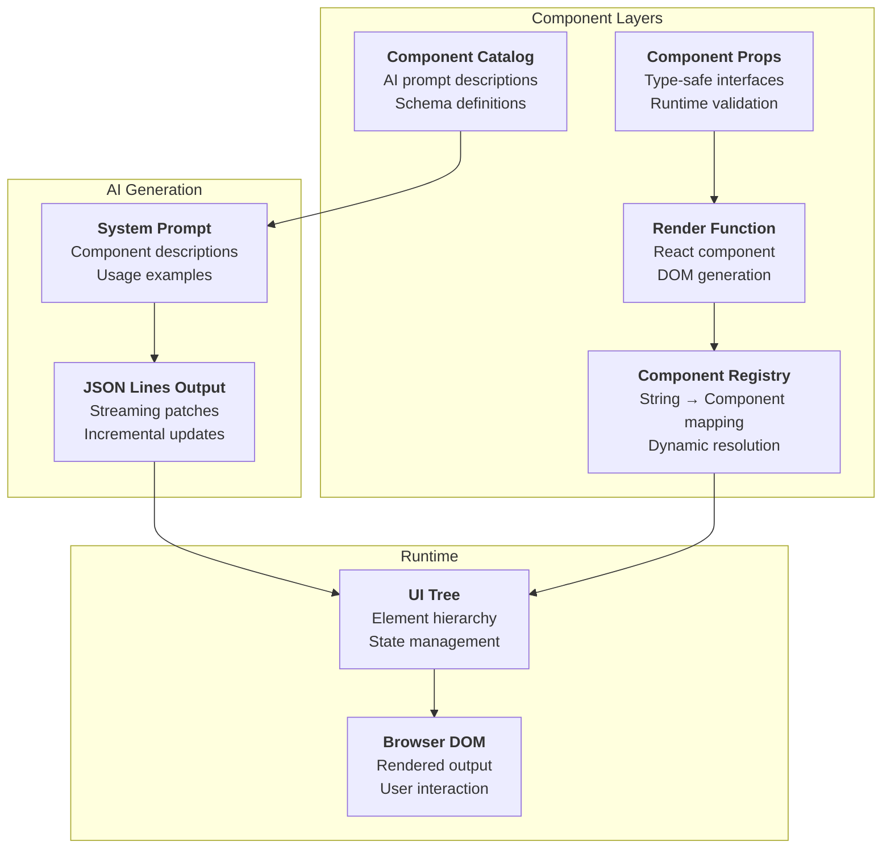

# Component System

## Overview

The AI JSON Render component system provides 22 pre-built UI components that can be dynamically generated and rendered. Each component is type-safe, supports custom styling, and integrates with the broader data flow system.

## Component Architecture



## Component Categories

### Layout Components

#### Stack
**Purpose**: Flexible container for horizontal or vertical layouts

```typescript
// From apps/web/components/demo/stack.tsx
interface StackProps {
  direction?: "horizontal" | "vertical";
  gap?: "sm" | "md" | "lg";
  className?: string[];
}
```

**Implementation highlights:**
```tsx
// From apps/web/components/demo/stack.tsx:8-18
export function Stack({ element, children }: ComponentRenderProps) {
  const { props } = element;
  const customClass = getCustomClass(props);
  const direction = props.direction as string;
  const gap = props.gap as string;
  const isHorizontal = direction === "horizontal";
  
  const gapClass =
    gap === "lg" ? "gap-4" : gap === "md" ? "gap-3" : "gap-2";
  
  return (
    <div
      className={`flex ${
        isHorizontal ? "flex-row flex-wrap" : "flex-col"
      } ${gapClass} ${baseClass} ${customClass}`}
    >
      {children}
    </div>
  );
}
```

#### Grid
**Purpose**: CSS Grid layout with responsive columns

```typescript
interface GridProps {
  columns?: 2 | 3 | 4;
  gap?: "sm" | "md" | "lg";
  className?: string[];
}
```

**Mobile-first responsive pattern:**
```tsx
// From apps/web/components/demo/grid.tsx:16-23
const colsClass = 
  cols === 4 ? "grid-cols-1" :
  cols === 3 ? "grid-cols-1" : 
  cols === 2 ? "grid-cols-1" : "grid-cols-1";
  
// Custom classes enable responsive breakpoints:
// className: ["sm:grid-cols-2", "lg:grid-cols-3"]
```

#### Card  
**Purpose**: Container for content sections with optional title/description

```typescript
interface CardProps {
  title?: string;
  description?: string;
  maxWidth?: "sm" | "md" | "lg" | "full";
  centered?: boolean;
  className?: string[];
}
```

### Form Components

#### Input
**Purpose**: Text input field with label and validation

```tsx
// From apps/web/components/demo/input.tsx
export function Input({ element }: ComponentRenderProps) {
  const { props } = element;
  const label = props.label as string;
  const name = props.name as string;
  const type = (props.type as string) || "text";
  const placeholder = props.placeholder as string;
  
  return (
    <div className={`space-y-1.5 ${baseClass} ${customClass}`}>
      <label className="block text-xs font-medium text-foreground">
        {label}
      </label>
      <input
        type={type}
        name={name}
        placeholder={placeholder}
        className="w-full px-2.5 py-1.5 text-xs border border-border rounded bg-background text-foreground placeholder:text-muted-foreground"
      />
    </div>
  );
}
```

#### Select
**Purpose**: Dropdown selection with interactive state management

**State management pattern:**
```tsx
// From apps/web/components/demo/select.tsx:18-35
const isOpen = getOpenSelect() === element.key;
const currentValue = getSelectValue(element.key) || "";

const handleToggle = () => {
  setOpenSelectValue(isOpen ? null : element.key);
};

const handleSelect = (value: string) => {
  setSelectValueForKey(element.key, value);
  setOpenSelectValue(null);
};
```

*Reference: Interactive state in [`apps/web/components/demo/utils.ts:16-53`](../apps/web/components/demo/utils.ts#L16-L53)*

### Action Components  

#### Button
**Purpose**: Clickable action trigger with variant styling

```tsx
// From apps/web/components/demo/button.tsx:6-20
export function Button({ element }: ComponentRenderProps) {
  const { props } = element;
  const variant = props.variant as string;
  const label = props.label as string;
  const actionText = (props.actionText as string) || label;
  
  const btnClass =
    variant === "danger" ? "bg-red-500 text-white" :
    variant === "secondary" ? "bg-card border border-border text-foreground" :
    "bg-foreground text-background";
    
  return (
    <button
      onClick={() => window.__demoAction?.(actionText)}
      className={`self-start px-3 py-1.5 rounded text-xs font-medium hover:opacity-90 transition-opacity ${btnClass} ${baseClass} ${customClass}`}
    >
      {label}
    </button>
  );
}
```

**Demo action system:**
```typescript
// From apps/web/components/demo/utils.ts (inferred)
declare global {
  interface Window {
    __demoAction?: (text: string) => void;
  }
}
```

### Data Display Components

#### Badge
**Purpose**: Status indicator with color variants

```tsx
// From apps/web/components/demo/badge.tsx
const variantClass = 
  variant === "success" ? "bg-green-100 text-green-800 border-green-200" :
  variant === "warning" ? "bg-yellow-100 text-yellow-800 border-yellow-200" :
  variant === "danger" ? "bg-red-100 text-red-800 border-red-200" :
  "bg-gray-100 text-gray-800 border-gray-200";
```

#### Progress
**Purpose**: Progress bar with percentage display

```tsx
// From apps/web/components/demo/progress.tsx:13-22
const percentage = Math.min(100, Math.max(0, (value / max) * 100));

return (
  <div className={`space-y-1.5 ${baseClass} ${customClass}`}>
    {label && (
      <div className="flex justify-between text-xs">
        <span className="text-foreground font-medium">{label}</span>
        <span className="text-muted-foreground">{Math.round(percentage)}%</span>
      </div>
    )}
    <div className="w-full bg-muted rounded-full h-2">
      <div
        className="bg-foreground h-2 rounded-full transition-all duration-300"
        style={{ width: `${percentage}%` }}
      />
    </div>
  </div>
);
```

### Chart Components

#### BarGraph
**Purpose**: Vertical bar chart for data visualization

```tsx
// From apps/web/components/demo/bar-graph.tsx:16-34
const maxValue = Math.max(...data.map((d) => d.value));
const chartHeight = 120;

return (
  <div className={`space-y-3 ${baseClass} ${customClass}`}>
    {title && <h3 className="text-sm font-medium text-foreground">{title}</h3>}
    <div className="flex items-end justify-between gap-2" style={{ height: chartHeight }}>
      {data.map((item, index) => {
        const height = maxValue > 0 ? (item.value / maxValue) * (chartHeight - 20) : 0;
        return (
          <div key={index} className="flex-1 flex flex-col items-center gap-1">
            <div
              className="w-full bg-foreground rounded-sm min-h-[2px] transition-all duration-300"
              style={{ height: `${height}px` }}
            />
            <span className="text-xs text-muted-foreground text-center break-all">
              {item.label}
            </span>
          </div>
        );
      })}
    </div>
  </div>
);
```

## Component Registration System

### Registry Creation

Components are registered in a type-safe registry:

```typescript
// From apps/web/components/demo/index.ts:52-84
export const demoRegistry: ComponentRegistry = {
  Alert,
  Avatar, 
  Badge,
  BarGraph,
  Button,
  Card,
  Checkbox,
  Divider,
  Form,
  Grid,
  Heading,
  Image,
  Input,
  LineGraph,
  Link,
  Progress,
  Radio,
  Rating,
  Select,
  Stack,
  Switch,
  Text,
  Textarea,
};

export const fallbackComponent: ComponentRenderer = Fallback;
```

### Fallback Component

Unknown component types render a fallback:

```tsx
// From apps/web/components/demo/fallback.tsx
export function Fallback({ element }: ComponentRenderProps) {
  return (
    <div className={`p-2 border border-dashed border-red-300 bg-red-50 rounded ${baseClass}`}>
      <p className="text-xs text-red-600">
        Unknown component: <code>{element.type}</code>
      </p>
      <p className="text-xs text-red-500 mt-1">
        Props: <code>{JSON.stringify(element.props)}</code>
      </p>
    </div>
  );
}
```

## Styling System

### Base Animation Class

All components inherit a base animation class:

```typescript
// From apps/web/components/demo/utils.ts:6-7
export const baseClass = 
  "animate-in fade-in slide-in-from-bottom-1 duration-200";
```

### Custom Classes

Components support Tailwind class arrays:

```typescript
// From apps/web/components/demo/utils.ts:9-13
export function getCustomClass(props: Record<string, unknown>): string {
  return Array.isArray(props.className)
    ? (props.className as string[]).join(" ")
    : "";
}
```

**Usage pattern:**
```json
{
  "op": "add",
  "path": "/elements/grid",
  "value": {
    "key": "grid",
    "type": "Grid", 
    "props": {
      "columns": 1,
      "className": ["sm:grid-cols-2", "lg:grid-cols-3", "gap-4"]
    }
  }
}
```

## AI Prompt Integration

Components are described in the system prompt for AI generation:

```typescript
// From apps/web/app/api/generate/route.ts:7-48
const SYSTEM_PROMPT = `You are a UI generator that outputs JSONL (JSON Lines) patches.

AVAILABLE COMPONENTS (22):

Layout:
- Card: { title?: string, description?: string, maxWidth?: "sm"|"md"|"lg"|"full", centered?: boolean } - Container card for content sections. Has children. Use for forms/content boxes, NOT for page headers.
- Stack: { direction?: "horizontal"|"vertical", gap?: "sm"|"md"|"lg" } - Flex container. Has children.
- Grid: { columns?: 2|3|4, gap?: "sm"|"md"|"lg" } - Grid layout. Has children. ALWAYS use mobile-first: set columns:1 and use className for larger screens.

Form Inputs:
- Input: { label: string, name: string, type?: "text"|"email"|"password"|"number", placeholder?: string } - Text input
- Textarea: { label: string, name: string, placeholder?: string, rows?: number } - Multi-line text
- Select: { label: string, name: string, options: string[], placeholder?: string } - Dropdown select
...`;
```

## Interactive State Management

### Global State Pattern

Components requiring interaction use a global state pattern:

```typescript
// From apps/web/components/demo/utils.ts:16-32
let openSelect: string | null = null;
let setOpenSelect: (v: string | null) => void = () => {};
let selectValues: Record<string, string> = {};
let setSelectValues: (fn: (prev: Record<string, string>) => Record<string, string>) => void = () => {};

export function useInteractiveState() {
  const [_openSelect, _setOpenSelect] = useState<string | null>(null);
  const [_selectValues, _setSelectValues] = useState<Record<string, string>>({});

  openSelect = _openSelect;
  setOpenSelect = _setOpenSelect;
  selectValues = _selectValues;
  setSelectValues = _setSelectValues;

  return { openSelect, selectValues };
}
```

**Benefits:**
- Shared state across component instances
- No prop drilling required
- Simple API for stateful components
- Compatible with streaming updates

## Validation & Type Safety

### Runtime Props Validation

Components receive typed props but validate at runtime:

```typescript
// Example validation pattern (conceptual)
function validateComponentProps<T>(
  element: UIElement,
  schema: ZodSchema<T>
): T {
  const result = schema.safeParse(element.props);
  if (!result.success) {
    console.warn(`Invalid props for ${element.type}:`, result.error);
    return {} as T;
  }
  return result.data;
}
```

### Component Interface

All components implement the same interface:

```typescript
// From apps/web/components/demo/types.ts:4-9
export interface ComponentRenderProps {
  element: UIElement;
  children?: ReactNode;
  onAction?: (action: Action) => void;
  loading?: boolean;
}
```

## Performance Considerations

### Efficient Rendering

- **Stable Keys**: Element keys provide stable React reconciliation
- **Minimal Re-renders**: Only changed elements re-render during streaming
- **Lazy Evaluation**: Components only resolve props when rendered

### Memory Optimization

- **Flat Storage**: UI tree uses flat element storage for efficiency
- **Reference Sharing**: Child arrays contain string keys, not object copies
- **Cleanup**: Unused elements are garbage collected automatically

## Component Extension

### Adding New Components

1. **Create Component File**:
   ```tsx
   // apps/web/components/demo/my-component.tsx
   export function MyComponent({ element }: ComponentRenderProps) {
     // Implementation
   }
   ```

2. **Register Component**:
   ```typescript
   // apps/web/components/demo/index.ts
   export const demoRegistry = {
     ...existingComponents,
     MyComponent,
   };
   ```

3. **Update System Prompt**:
   ```typescript
   // apps/web/app/api/generate/route.ts
   const SYSTEM_PROMPT = `...
   - MyComponent: { prop1: string, prop2?: number } - Description
   ...`;
   ```

### Best Practices

1. **Type Safety**: Use TypeScript interfaces for props
2. **Accessibility**: Include ARIA attributes and semantic HTML
3. **Responsive Design**: Support mobile-first responsive patterns
4. **Error Handling**: Graceful degradation for invalid props
5. **Animation**: Use consistent base animation classes
6. **Testing**: Unit tests for component logic and edge cases

## Next Steps

- [🔄 Data Flow & Streaming](./04-data-flow.md)
- [🚀 API Reference](./05-api-reference.md)  
- [🧪 Testing Guide](./06-testing.md)