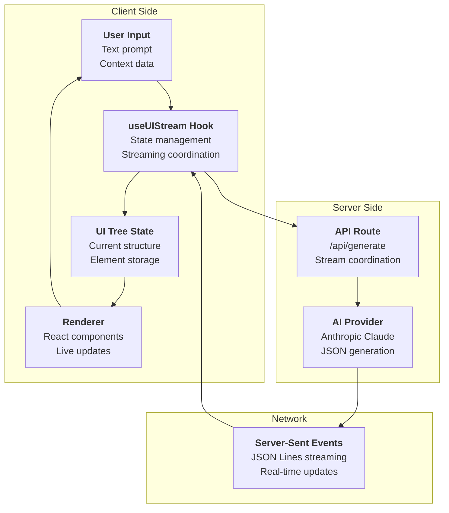
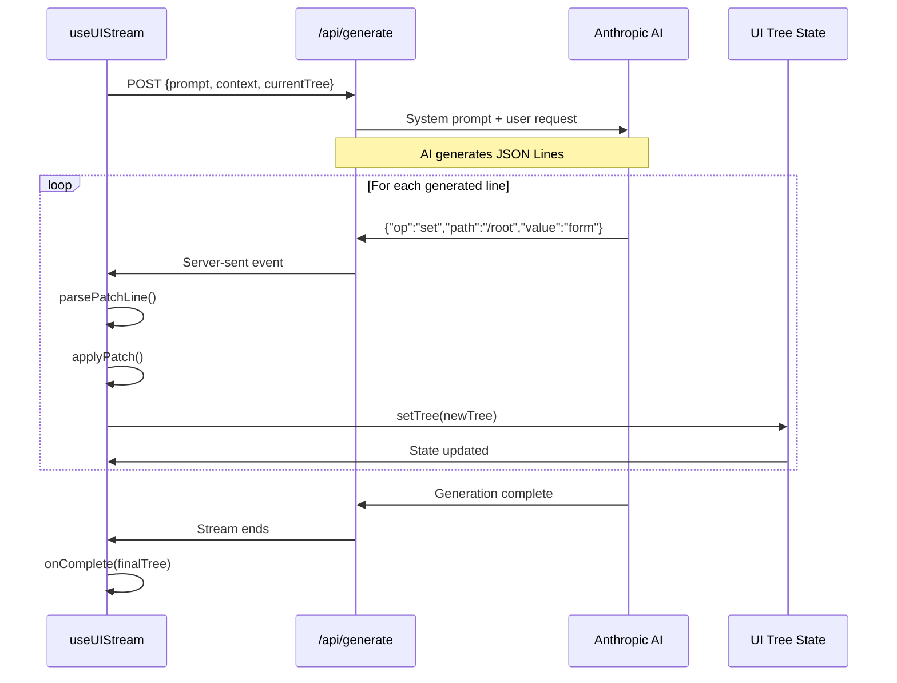
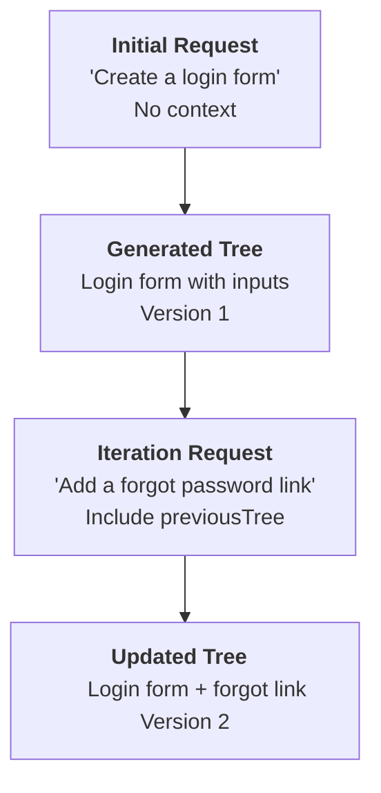

# Data Flow & Streaming

## Overview

The AI JSON Render system implements real-time streaming architecture where AI-generated JSON patches are applied incrementally to build and update UI trees. This enables live preview of UI generation and seamless iteration on existing interfaces.

## Streaming Architecture



## useUIStream Hook Deep Dive

The `useUIStream` hook is the core of the streaming system:

```typescript
// From packages/react/src/hooks.ts:96-112
export function useUIStream({
  api,
  onComplete,
  onError,
}: UseUIStreamOptions): UseUIStreamReturn {
  const [tree, setTree] = useState<UITree | null>(null);
  const [isStreaming, setIsStreaming] = useState(false);
  const [error, setError] = useState<Error | null>(null);
  const abortControllerRef = useRef<AbortController | null>(null);

  return {
    tree,        // Current UI tree state
    isStreaming, // Streaming status flag
    error,       // Any error that occurred
    send,        // Function to start generation
    clear,       // Function to reset state
  };
}
```

### Streaming Request Flow



### Stream Processing Implementation

```typescript
// From packages/react/src/hooks.ts:132-185
const send = useCallback(async (prompt: string, context?: Record<string, unknown>) => {
  // 1. Setup request with abort controller
  abortControllerRef.current?.abort();
  abortControllerRef.current = new AbortController();
  
  setIsStreaming(true);
  setError(null);

  // 2. Initialize tree state (preserve previous tree if iterating)
  const previousTree = context?.previousTree as UITree | undefined;
  let currentTree: UITree = previousTree && previousTree.root
    ? { ...previousTree, elements: { ...previousTree.elements } }
    : { root: "", elements: {} };
  setTree(currentTree);

  try {
    // 3. Start streaming request
    const response = await fetch(api, {
      method: "POST",
      headers: { "Content-Type": "application/json" },
      body: JSON.stringify({ prompt, context, currentTree }),
      signal: abortControllerRef.current.signal,
    });

    // 4. Process streaming response
    const reader = response.body?.getReader();
    const decoder = new TextDecoder();
    let buffer = "";

    while (true) {
      const { done, value } = await reader.read();
      if (done) break;

      buffer += decoder.decode(value, { stream: true });
      
      // Process complete lines
      const lines = buffer.split("\n");
      buffer = lines.pop() ?? "";

      for (const line of lines) {
        const patch = parsePatchLine(line);
        if (patch) {
          currentTree = applyPatch(currentTree, patch);
          setTree({ ...currentTree });
        }
      }
    }
  } catch (err) {
    // Handle errors and cleanup
    if ((err as Error).name === "AbortError") return;
    const error = err instanceof Error ? err : new Error(String(err));
    setError(error);
    onError?.(error);
  } finally {
    setIsStreaming(false);
  }
}, [api, onComplete, onError]);
```

## JSON Patch System

### Patch Format

The system uses RFC 6902-inspired JSON patches for incremental updates:

```typescript
// From packages/core/src/types.ts:140-148
interface PatchOp {
  op: "add" | "set" | "remove" | "replace";
  path: string;
  value?: any;
}

type JsonPatch = PatchOp;
```

### Patch Operations

#### 1. Set Root Element
```json
{"op":"set","path":"/root","value":"login-form"}
```

#### 2. Add Element  
```json
{
  "op":"add",
  "path":"/elements/login-form",
  "value":{
    "key":"login-form",
    "type":"Card",
    "props":{"title":"Login","maxWidth":"sm","centered":true},
    "children":["username","password","submit"]
  }
}
```

#### 3. Update Element Property
```json
{"op":"set","path":"/elements/login-form/props/title","value":"Sign In"}
```

#### 4. Remove Element
```json
{"op":"remove","path":"/elements/old-element"}
```

### Patch Application Logic

```typescript
// From packages/react/src/hooks.ts:26-67
function applyPatch(tree: UITree, patch: JsonPatch): UITree {
  const newTree = { ...tree, elements: { ...tree.elements } };

  switch (patch.op) {
    case "set":
    case "add":
    case "replace": {
      // Handle root path
      if (patch.path === "/root") {
        newTree.root = patch.value as string;
        return newTree;
      }

      // Handle elements paths
      if (patch.path.startsWith("/elements/")) {
        const pathParts = patch.path.slice("/elements/".length).split("/");
        const elementKey = pathParts[0];

        if (!elementKey) return newTree;

        if (pathParts.length === 1) {
          // Setting entire element
          newTree.elements[elementKey] = patch.value as UIElement;
        } else {
          // Setting property of element
          const element = newTree.elements[elementKey];
          if (element) {
            const propPath = "/" + pathParts.slice(1).join("/");
            const newElement = { ...element };
            setByPath(newElement, propPath, patch.value);
            newTree.elements[elementKey] = newElement;
          }
        }
      }
      break;
    }
    case "remove": {
      if (patch.path.startsWith("/elements/")) {
        const elementKey = patch.path.slice("/elements/".length).split("/")[0];
        if (elementKey) {
          const { [elementKey]: _, ...rest } = newTree.elements;
          newTree.elements = rest;
        }
      }
      break;
    }
  }

  return newTree;
}
```

## Server-Side Streaming

### API Route Implementation

```typescript
// From apps/web/app/api/generate/route.ts:57-81
export async function POST(req: Request) {
  const { prompt, context } = await req.json();
  const previousTree = context?.previousTree;

  const sanitizedPrompt = String(prompt || "").slice(0, MAX_PROMPT_LENGTH);

  // Build user prompt with context for iteration
  let userPrompt = sanitizedPrompt;
  if (previousTree && previousTree.root && Object.keys(previousTree.elements || {}).length > 0) {
    userPrompt = `CURRENT UI STATE (already loaded, DO NOT recreate existing elements):
${JSON.stringify(previousTree, null, 2)}

USER REQUEST: ${sanitizedPrompt}

IMPORTANT: The current UI is already loaded. Output ONLY the patches needed to make the requested change:
- To add a new element: {"op":"add","path":"/elements/new-key","value":{...}}
- To modify an existing element: {"op":"set","path":"/elements/existing-key","value":{...}}
- To update the root: {"op":"set","path":"/root","value":"new-root-key"}
- To add children: update the parent element with new children array

DO NOT output patches for elements that don't need to change. Only output what's necessary for the requested modification.`;
  }

  const model = anthropic(process.env.AI_GATEWAY_MODEL || "claude-3-5-sonnet-20241022");

  const result = streamText({
    model,
    system: SYSTEM_PROMPT,
    prompt: userPrompt,
    temperature: 0.7,
  });

  return result.toTextStreamResponse();
}
```

### Iteration Context

The system supports iterative UI development by including the current tree in subsequent requests:



**Context structure:**
```typescript
// Sent to API route for iteration
{
  prompt: "Add a forgot password link",
  context: {
    previousTree: {
      root: "login-form",
      elements: {
        "login-form": { /* existing elements */ }
      }
    }
  }
}
```

## Playground Integration

### Version Management

The playground maintains a history of generated versions:

```typescript
// From apps/web/components/playground.tsx:26-31
interface Version {
  id: string;
  prompt: string; 
  tree: UITree | null;
  status: "generating" | "complete";
}
```

### State Coordination

```typescript
// From apps/web/components/playground.tsx:44-65
const {
  tree: apiTree,
  isStreaming,
  send,
  clear,
} = useUIStream({
  api: "/api/generate",
  onError: (err: Error) => console.error("Generation error:", err),
});

// Determine which tree to display:
// - If streaming and selected version is the generating one, show apiTree  
// - Otherwise show the selected version's tree
const isSelectedVersionGenerating = 
  selectedVersionId === generatingVersionIdRef.current && isStreaming;
const hasValidApiTree = 
  apiTree && apiTree.root && Object.keys(apiTree.elements).length > 0;

const currentTree = isSelectedVersionGenerating && hasValidApiTree
  ? apiTree
  : (selectedVersion?.tree ?? (isSelectedVersionGenerating ? apiTree : null));
```

### Generation Flow

```typescript
// From apps/web/components/playground.tsx:150+ (inferred)
const handleSubmit = useCallback(async () => {
  if (!inputValue.trim()) return;
  
  // Create new version entry
  const versionId = `v-${Date.now()}`;
  generatingVersionIdRef.current = versionId;
  
  setVersions(prev => [...prev, {
    id: versionId,
    prompt: inputValue,
    tree: null,
    status: "generating"
  }]);
  
  // Start generation with current tree as context
  await send(inputValue, {
    previousTree: currentTreeRef.current
  });
  
  // Update version when complete
  setVersions(prev => prev.map(v => 
    v.id === versionId 
      ? { ...v, tree: apiTree, status: "complete" }
      : v
  ));
}, [inputValue, send]);
```

## Error Handling & Recovery

### Stream Error Handling

```typescript
// From packages/react/src/hooks.ts:186-197
} catch (err) {
  // Handle abort vs real errors
  if ((err as Error).name === "AbortError") {
    return; // User cancelled - no error state
  }
  
  const error = err instanceof Error ? err : new Error(String(err));
  setError(error);
  onError?.(error);
} finally {
  setIsStreaming(false);
}
```

### Patch Parsing Errors

```typescript
// From packages/react/src/hooks.ts:15-24
function parsePatchLine(line: string): JsonPatch | null {
  try {
    const trimmed = line.trim();
    if (!trimmed || trimmed.startsWith("//")) {
      return null; // Skip empty lines and comments
    }
    return JSON.parse(trimmed) as JsonPatch;
  } catch {
    return null; // Skip invalid JSON lines
  }
}
```

### Request Cancellation

```typescript
// From packages/react/src/hooks.ts:122-124
// Abort any existing request
abortControllerRef.current?.abort();
abortControllerRef.current = new AbortController();
```

## Performance Optimizations

### Streaming Benefits

1. **Immediate Feedback**: UI appears as soon as first patches arrive
2. **Incremental Updates**: Only changed elements re-render
3. **Cancellation**: In-flight requests can be aborted
4. **Memory Efficiency**: Patches applied directly to existing tree

### Tree Update Optimization

```typescript
// Immutable tree updates with structural sharing
const newTree = { 
  ...tree, 
  elements: { 
    ...tree.elements,
    [elementKey]: updatedElement // Only updated element changes
  } 
};
```

### React Reconciliation

- **Stable Keys**: Element keys provide efficient React reconciliation  
- **Selective Re-renders**: Only updated tree branches re-render
- **Component Memoization**: Components can memoize based on element props

## Data Contexts

### Context Provider Integration

The streaming system integrates with React contexts for extended functionality:

```typescript
// From packages/react/src/renderer.tsx:188-233
export function JSONUIProvider({
  children,
  initialData,
  authState,
  onAction,
}: JSONUIProviderProps) {
  return (
    <DataProvider initialData={initialData}>
      <VisibilityProvider authState={authState}>
        <ActionProvider onAction={onAction}>
          <ValidationProvider>
            {children}
          </ValidationProvider>
        </ActionProvider>
      </VisibilityProvider>
    </DataProvider>
  );
}
```

### Dynamic Data Binding

Components can bind to external data sources:

```typescript
// Dynamic value resolution example
const resolveValue = (value: DynamicValue<string>, data: DataModel): string => {
  if (typeof value === "string") return value;
  if (typeof value === "object" && value.path) {
    return getByPath(data, value.path) as string;
  }
  return "";
};
```

## Testing Streaming

### Mock Stream Testing

```typescript
// Conceptual test structure
describe('useUIStream', () => {
  it('applies patches incrementally', async () => {
    const { result } = renderHook(() => useUIStream({
      api: '/mock-api'
    }));
    
    // Mock server-sent events
    mockEventSource.emit('{"op":"set","path":"/root","value":"test"}');
    
    expect(result.current.tree?.root).toBe("test");
    
    mockEventSource.emit('{"op":"add","path":"/elements/test","value":{...}}');
    
    expect(result.current.tree?.elements.test).toBeDefined();
  });
});
```

## Next Steps

- [🚀 API Reference](./05-api-reference.md)
- [🧪 Testing Guide](./06-testing.md)
- [🔧 Development Setup](./07-development.md)