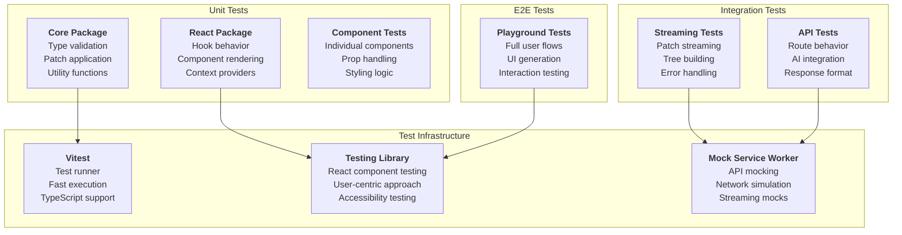

# Testing Guide

## Testing Strategy

The AI JSON Render system requires testing at multiple levels: unit tests for core logic, integration tests for streaming behavior, and end-to-end tests for the complete AI generation flow.

## Testing Architecture



## Test Configuration

### Vitest Configuration

```typescript
// vitest.config.ts
import { defineConfig } from 'vitest/config';
import { resolve } from 'path';

export default defineConfig({
  test: {
    globals: true,
    environment: 'jsdom',
    setupFiles: ['./test/setup.ts'],
    coverage: {
      provider: 'v8',
      reporter: ['text', 'json', 'html'],
      exclude: [
        'node_modules/',
        'dist/',
        '**/*.test.{ts,tsx}',
        '**/*.spec.{ts,tsx}',
      ]
    }
  },
  resolve: {
    alias: {
      '@json-render/core': resolve(__dirname, './packages/core/src'),
      '@json-render/react': resolve(__dirname, './packages/react/src'),
      '@json-render/codegen': resolve(__dirname, './packages/codegen/src'),
    }
  }
});
```

*Reference: [`vitest.config.ts`](../../vitest.config.ts)*

### Test Setup

```typescript
// test/setup.ts
import '@testing-library/jest-dom';
import { cleanup } from '@testing-library/react';
import { afterEach, beforeAll, afterAll } from 'vitest';
import { server } from './mocks/server';

// Setup MSW server
beforeAll(() => server.listen({ onUnhandledRequest: 'error' }));
afterEach(() => {
  cleanup();
  server.resetHandlers();
});
afterAll(() => server.close());

// Mock window objects for demo components
Object.defineProperty(window, '__demoAction', {
  value: vitest.fn(),
  writable: true
});
```

## Core Package Tests

### Type System Tests

```typescript
// packages/core/src/types.test.ts
import { describe, it, expect } from 'vitest';
import { 
  DynamicValueSchema, 
  resolveDynamicValue, 
  getByPath, 
  setByPath 
} from './types';

describe('Dynamic Values', () => {
  it('resolves literal values', () => {
    expect(resolveDynamicValue("hello", {})).toBe("hello");
    expect(resolveDynamicValue(42, {})).toBe(42);
    expect(resolveDynamicValue(true, {})).toBe(true);
  });

  it('resolves path-based values', () => {
    const data = { user: { name: "John" } };
    const value = { path: "user.name" };
    
    expect(resolveDynamicValue(value, data)).toBe("John");
  });

  it('handles missing paths gracefully', () => {
    const data = { user: {} };
    const value = { path: "user.missing" };
    
    expect(resolveDynamicValue(value, data)).toBeUndefined();
  });

  it('validates dynamic value schemas', () => {
    expect(() => DynamicValueSchema.parse("string")).not.toThrow();
    expect(() => DynamicValueSchema.parse({ path: "test" })).not.toThrow();
    expect(() => DynamicValueSchema.parse({ invalid: true })).toThrow();
  });
});

describe('Path Utilities', () => {
  it('gets nested values by path', () => {
    const obj = { a: { b: { c: "value" } } };
    expect(getByPath(obj, "a.b.c")).toBe("value");
    expect(getByPath(obj, "a.b")).toEqual({ c: "value" });
    expect(getByPath(obj, "missing")).toBeUndefined();
  });

  it('sets nested values by path', () => {
    const obj = { a: { b: {} } };
    setByPath(obj, "a.b.c", "new value");
    expect(getByPath(obj, "a.b.c")).toBe("new value");
  });

  it('creates missing paths when setting', () => {
    const obj = {};
    setByPath(obj, "a.b.c", "value");
    expect(getByPath(obj, "a.b.c")).toBe("value");
  });
});
```

*Reference: [`packages/core/src/types.test.ts`](../../packages/core/src/types.test.ts)*

### Visibility System Tests

```typescript
// packages/core/src/visibility.test.ts
import { describe, it, expect } from 'vitest';
import { evaluateVisibility, evaluateLogicExpression } from './visibility';

describe('Visibility Evaluation', () => {
  const context = {
    authState: { isSignedIn: true, user: { role: 'admin' } },
    data: { settings: { darkMode: true } }
  };

  it('evaluates boolean conditions', () => {
    expect(evaluateVisibility(true, context)).toBe(true);
    expect(evaluateVisibility(false, context)).toBe(false);
  });

  it('evaluates auth conditions', () => {
    expect(evaluateVisibility({ auth: "signedIn" }, context)).toBe(true);
    expect(evaluateVisibility({ auth: "signedOut" }, context)).toBe(false);
  });

  it('evaluates path conditions', () => {
    expect(evaluateVisibility({ path: "settings.darkMode" }, context)).toBe(true);
    expect(evaluateVisibility({ path: "settings.lightMode" }, context)).toBe(false);
  });

  it('evaluates logic expressions', () => {
    const andExpr = {
      and: [
        { auth: "signedIn" },
        { path: "settings.darkMode" }
      ]
    };
    expect(evaluateVisibility(andExpr, context)).toBe(true);

    const orExpr = {
      or: [
        { auth: "signedOut" },
        { path: "settings.darkMode" }
      ]
    };
    expect(evaluateVisibility(orExpr, context)).toBe(true);

    const notExpr = {
      not: { auth: "signedOut" }
    };
    expect(evaluateVisibility(notExpr, context)).toBe(true);
  });
});
```

*Reference: [`packages/core/src/visibility.test.ts`](../../packages/core/src/visibility.test.ts)*

### Action System Tests

```typescript
// packages/core/src/actions.test.ts
import { describe, it, expect } from 'vitest';
import { resolveAction, interpolateString, executeAction } from './actions';

describe('Action Resolution', () => {
  const dataModel = { user: { name: "John", id: 123 } };

  it('resolves static params', () => {
    const action = {
      name: "updateUser",
      params: { name: "Jane", id: 456 }
    };

    const resolved = resolveAction(action, dataModel);
    expect(resolved.params).toEqual({ name: "Jane", id: 456 });
  });

  it('resolves dynamic params', () => {
    const action = {
      name: "updateUser", 
      params: {
        name: { path: "user.name" },
        id: { path: "user.id" }
      }
    };

    const resolved = resolveAction(action, dataModel);
    expect(resolved.params).toEqual({ name: "John", id: 123 });
  });

  it('interpolates confirmation messages', () => {
    const action = {
      name: "deleteUser",
      confirm: {
        title: "Delete User",
        message: "Are you sure you want to delete ${user.name}?"
      }
    };

    const resolved = resolveAction(action, dataModel);
    expect(resolved.confirm?.message).toBe("Are you sure you want to delete John?");
  });
});

describe('String Interpolation', () => {
  const dataModel = { user: { name: "John", count: 5 } };

  it('interpolates single variables', () => {
    expect(interpolateString("Hello ${user.name}", dataModel))
      .toBe("Hello John");
  });

  it('interpolates multiple variables', () => {
    expect(interpolateString("${user.name} has ${user.count} items", dataModel))
      .toBe("John has 5 items");
  });

  it('handles missing variables', () => {
    expect(interpolateString("Hello ${user.missing}", dataModel))
      .toBe("Hello ");
  });
});
```

*Reference: [`packages/core/src/actions.test.ts`](../../packages/core/src/actions.test.ts)*

## React Package Tests

### useUIStream Hook Tests

```typescript
// packages/react/src/hooks.test.ts
import { describe, it, expect, vi } from 'vitest';
import { renderHook, waitFor } from '@testing-library/react';
import { useUIStream } from './hooks';
import { server } from '../../test/mocks/server';
import { http, HttpResponse } from 'msw';

describe('useUIStream Hook', () => {
  it('initializes with empty state', () => {
    const { result } = renderHook(() => useUIStream({ api: '/api/generate' }));

    expect(result.current.tree).toBeNull();
    expect(result.current.isStreaming).toBe(false);
    expect(result.current.error).toBeNull();
  });

  it('handles successful streaming', async () => {
    // Mock streaming response
    server.use(
      http.post('/api/generate', () => {
        const stream = new ReadableStream({
          start(controller) {
            controller.enqueue(new TextEncoder().encode('{"op":"set","path":"/root","value":"test"}\n'));
            controller.enqueue(new TextEncoder().encode('{"op":"add","path":"/elements/test","value":{"key":"test","type":"Text","props":{"content":"Hello"}}}\n'));
            controller.close();
          }
        });

        return new HttpResponse(stream, {
          headers: { 'Content-Type': 'text/plain' }
        });
      })
    );

    const { result } = renderHook(() => useUIStream({ api: '/api/generate' }));

    // Start generation
    result.current.send("Create a text component");

    // Check streaming state
    expect(result.current.isStreaming).toBe(true);

    // Wait for completion
    await waitFor(() => {
      expect(result.current.isStreaming).toBe(false);
    });

    // Verify final tree
    expect(result.current.tree?.root).toBe("test");
    expect(result.current.tree?.elements.test).toEqual({
      key: "test",
      type: "Text", 
      props: { content: "Hello" }
    });
  });

  it('handles streaming errors', async () => {
    const onError = vi.fn();
    
    server.use(
      http.post('/api/generate', () => {
        return HttpResponse.error();
      })
    );

    const { result } = renderHook(() => useUIStream({ 
      api: '/api/generate',
      onError 
    }));

    result.current.send("Generate UI");

    await waitFor(() => {
      expect(result.current.isStreaming).toBe(false);
    });

    expect(result.current.error).toBeTruthy();
    expect(onError).toHaveBeenCalled();
  });

  it('cancels previous requests', async () => {
    const { result } = renderHook(() => useUIStream({ api: '/api/generate' }));

    // Start first request
    result.current.send("First request");
    expect(result.current.isStreaming).toBe(true);

    // Start second request (should cancel first)
    result.current.send("Second request");
    
    // Should still be streaming the second request
    expect(result.current.isStreaming).toBe(true);
  });

  it('clears tree state', () => {
    const { result } = renderHook(() => useUIStream({ api: '/api/generate' }));

    // Set some tree state (mock)
    // This would typically come from a previous generation
    
    result.current.clear();
    
    expect(result.current.tree).toBeNull();
    expect(result.current.error).toBeNull();
  });
});
```

### Renderer Component Tests

```typescript
// packages/react/src/renderer.test.tsx
import { describe, it, expect } from 'vitest';
import { render, screen } from '@testing-library/react';
import { Renderer, JSONUIProvider } from './renderer';
import type { UITree, ComponentRegistry } from '../types';

// Mock component registry
const mockRegistry: ComponentRegistry = {
  Text: ({ element }) => <p data-testid="text">{element.props.content as string}</p>,
  Button: ({ element }) => <button data-testid="button">{element.props.label as string}</button>,
  Container: ({ children }) => <div data-testid="container">{children}</div>,
};

const mockFallback = ({ element }) => (
  <div data-testid="fallback">Unknown: {element.type}</div>
);

describe('Renderer Component', () => {
  it('renders null for empty tree', () => {
    const { container } = render(
      <Renderer tree={null} registry={mockRegistry} />
    );
    expect(container.firstChild).toBeNull();
  });

  it('renders single element tree', () => {
    const tree: UITree = {
      root: "text1",
      elements: {
        text1: {
          key: "text1",
          type: "Text",
          props: { content: "Hello World" }
        }
      }
    };

    render(<Renderer tree={tree} registry={mockRegistry} />);
    
    expect(screen.getByTestId("text")).toHaveTextContent("Hello World");
  });

  it('renders nested elements', () => {
    const tree: UITree = {
      root: "container",
      elements: {
        container: {
          key: "container",
          type: "Container",
          props: {},
          children: ["text1", "button1"]
        },
        text1: {
          key: "text1",
          type: "Text",
          props: { content: "Hello" }
        },
        button1: {
          key: "button1", 
          type: "Button",
          props: { label: "Click me" }
        }
      }
    };

    render(<Renderer tree={tree} registry={mockRegistry} />);
    
    expect(screen.getByTestId("container")).toBeInTheDocument();
    expect(screen.getByTestId("text")).toHaveTextContent("Hello");
    expect(screen.getByTestId("button")).toHaveTextContent("Click me");
  });

  it('uses fallback for unknown components', () => {
    const tree: UITree = {
      root: "unknown",
      elements: {
        unknown: {
          key: "unknown",
          type: "UnknownComponent",
          props: {}
        }
      }
    };

    render(
      <Renderer 
        tree={tree} 
        registry={mockRegistry} 
        fallback={mockFallback}
      />
    );
    
    expect(screen.getByTestId("fallback")).toHaveTextContent("Unknown: UnknownComponent");
  });

  it('handles missing child elements gracefully', () => {
    const tree: UITree = {
      root: "container",
      elements: {
        container: {
          key: "container",
          type: "Container", 
          props: {},
          children: ["text1", "missing"] // "missing" doesn't exist
        },
        text1: {
          key: "text1",
          type: "Text",
          props: { content: "Hello" }
        }
      }
    };

    render(<Renderer tree={tree} registry={mockRegistry} />);
    
    // Should render the existing child but not crash on missing one
    expect(screen.getByTestId("container")).toBeInTheDocument();
    expect(screen.getByTestId("text")).toHaveTextContent("Hello");
  });
});
```

### Context Provider Tests

```typescript
// packages/react/src/contexts/data.test.tsx
import { describe, it, expect } from 'vitest';
import { render, screen, fireEvent } from '@testing-library/react';
import { DataProvider, useData, useDataValue } from './data';

function TestComponent() {
  const { data, updateData } = useData();
  const userName = useDataValue<string>("user.name");

  return (
    <div>
      <p data-testid="username">{userName}</p>
      <button 
        data-testid="update"
        onClick={() => updateData("user.name", "Jane")}
      >
        Update
      </button>
      <p data-testid="full-data">{JSON.stringify(data)}</p>
    </div>
  );
}

describe('DataProvider', () => {
  it('provides initial data', () => {
    const initialData = { user: { name: "John", age: 30 } };

    render(
      <DataProvider initialData={initialData}>
        <TestComponent />
      </DataProvider>
    );

    expect(screen.getByTestId("username")).toHaveTextContent("John");
  });

  it('updates data at path', () => {
    const initialData = { user: { name: "John", age: 30 } };

    render(
      <DataProvider initialData={initialData}>
        <TestComponent />
      </DataProvider>
    );

    fireEvent.click(screen.getByTestId("update"));

    expect(screen.getByTestId("username")).toHaveTextContent("Jane");
  });

  it('creates nested paths when updating', () => {
    render(
      <DataProvider>
        <TestComponent />
      </DataProvider>
    );

    fireEvent.click(screen.getByTestId("update"));

    expect(screen.getByTestId("username")).toHaveTextContent("Jane");
  });
});
```

## Component Tests

### Individual Component Tests

```typescript
// apps/web/components/demo/button.test.tsx
import { describe, it, expect, vi } from 'vitest';
import { render, screen, fireEvent } from '@testing-library/react';
import { Button } from './button';
import type { UIElement } from '@json-render/core';

describe('Button Component', () => {
  const baseElement: UIElement = {
    key: "test-button",
    type: "Button",
    props: {}
  };

  beforeEach(() => {
    // Mock demo action
    window.__demoAction = vi.fn();
  });

  it('renders with label', () => {
    const element = {
      ...baseElement,
      props: { label: "Click me" }
    };

    render(<Button element={element} />);
    
    expect(screen.getByRole("button")).toHaveTextContent("Click me");
  });

  it('applies variant styling', () => {
    const element = {
      ...baseElement,
      props: { label: "Delete", variant: "danger" }
    };

    render(<Button element={element} />);
    
    const button = screen.getByRole("button");
    expect(button).toHaveClass("bg-red-500", "text-white");
  });

  it('handles click actions', () => {
    const element = {
      ...baseElement,
      props: { label: "Submit", actionText: "Form submitted" }
    };

    render(<Button element={element} />);
    
    fireEvent.click(screen.getByRole("button"));
    
    expect(window.__demoAction).toHaveBeenCalledWith("Form submitted");
  });

  it('uses label as default action text', () => {
    const element = {
      ...baseElement,
      props: { label: "Save" }
    };

    render(<Button element={element} />);
    
    fireEvent.click(screen.getByRole("button"));
    
    expect(window.__demoAction).toHaveBeenCalledWith("Save");
  });

  it('applies custom classes', () => {
    const element = {
      ...baseElement,
      props: { 
        label: "Custom", 
        className: ["custom-class", "another-class"]
      }
    };

    render(<Button element={element} />);
    
    const button = screen.getByRole("button");
    expect(button).toHaveClass("custom-class", "another-class");
  });
});
```

### Complex Component Tests

```typescript
// apps/web/components/demo/form.test.tsx
import { describe, it, expect } from 'vitest';
import { render, screen, fireEvent, waitFor } from '@testing-library/react';
import userEvent from '@testing-library/user-event';
import { Form } from './form';
import { JSONUIProvider } from '@json-render/react';

describe('Form Component', () => {
  const mockTree = {
    root: "form",
    elements: {
      form: {
        key: "form",
        type: "Form",
        props: {},
        children: ["name-input", "email-input", "submit-button"]
      },
      "name-input": {
        key: "name-input",
        type: "Input",
        props: { name: "name", label: "Full Name", placeholder: "Enter name" }
      },
      "email-input": {
        key: "email-input", 
        type: "Input",
        props: { name: "email", label: "Email", type: "email", placeholder: "Enter email" }
      },
      "submit-button": {
        key: "submit-button",
        type: "Button",
        props: { label: "Submit", variant: "primary" }
      }
    }
  };

  it('renders form with inputs', () => {
    render(
      <JSONUIProvider>
        <Form element={mockTree.elements.form}>
          {/* Children would be rendered by Renderer */}
        </Form>
      </JSONUIProvider>
    );

    expect(screen.getByRole("form")).toBeInTheDocument();
  });

  it('collects form data on submit', async () => {
    const onAction = vi.fn();
    
    render(
      <JSONUIProvider onAction={onAction}>
        {/* Full form rendering test would need complete tree rendering */}
      </JSONUIProvider>
    );

    // Test would fill form and submit
    // Verify onAction called with form data
  });
});
```

## Integration Tests

### Streaming Integration Tests

```typescript
// test/integration/streaming.test.ts
import { describe, it, expect } from 'vitest';
import { renderHook, waitFor } from '@testing-library/react';
import { useUIStream } from '@json-render/react';
import { server } from '../mocks/server';
import { http, HttpResponse } from 'msw';

describe('Streaming Integration', () => {
  it('builds UI tree from streaming patches', async () => {
    // Mock complete streaming response
    server.use(
      http.post('/api/generate', () => {
        const patches = [
          '{"op":"set","path":"/root","value":"login-form"}',
          '{"op":"add","path":"/elements/login-form","value":{"key":"login-form","type":"Card","props":{"title":"Login","centered":true},"children":["username","password","submit"]}}',
          '{"op":"add","path":"/elements/username","value":{"key":"username","type":"Input","props":{"name":"username","label":"Username","placeholder":"Enter username"}}}',
          '{"op":"add","path":"/elements/password","value":{"key":"password","type":"Input","props":{"name":"password","label":"Password","type":"password","placeholder":"Enter password"}}}',
          '{"op":"add","path":"/elements/submit","value":{"key":"submit","type":"Button","props":{"label":"Sign In","variant":"primary"}}}'
        ];

        const stream = new ReadableStream({
          start(controller) {
            patches.forEach((patch, index) => {
              setTimeout(() => {
                controller.enqueue(new TextEncoder().encode(patch + '\n'));
                if (index === patches.length - 1) {
                  controller.close();
                }
              }, index * 10); // Simulate streaming delay
            });
          }
        });

        return new HttpResponse(stream, {
          headers: { 'Content-Type': 'text/plain' }
        });
      })
    );

    const { result } = renderHook(() => useUIStream({ api: '/api/generate' }));

    await result.current.send("Create a login form");

    await waitFor(() => {
      expect(result.current.isStreaming).toBe(false);
    }, { timeout: 5000 });

    const tree = result.current.tree!;

    // Verify tree structure
    expect(tree.root).toBe("login-form");
    expect(tree.elements["login-form"]).toEqual({
      key: "login-form",
      type: "Card",
      props: { title: "Login", centered: true },
      children: ["username", "password", "submit"]
    });
    expect(tree.elements.username.props.label).toBe("Username");
    expect(tree.elements.password.props.type).toBe("password");
    expect(tree.elements.submit.props.variant).toBe("primary");
  });

  it('handles iterative updates', async () => {
    // First generation - basic form
    server.use(
      http.post('/api/generate', async ({ request }) => {
        const body = await request.json() as any;
        const isIteration = body.context?.previousTree;

        let patches: string[];
        
        if (isIteration) {
          // Add forgot password link
          patches = [
            '{"op":"set","path":"/elements/login-form/children","value":["username","password","submit","forgot-link"]}',
            '{"op":"add","path":"/elements/forgot-link","value":{"key":"forgot-link","type":"Link","props":{"label":"Forgot password?","href":"/forgot"}}}'
          ];
        } else {
          // Initial form creation
          patches = [
            '{"op":"set","path":"/root","value":"login-form"}',
            '{"op":"add","path":"/elements/login-form","value":{"key":"login-form","type":"Card","props":{"title":"Login"},"children":["username","password","submit"]}}',
            '{"op":"add","path":"/elements/username","value":{"key":"username","type":"Input","props":{"name":"username","label":"Username"}}}',
            '{"op":"add","path":"/elements/password","value":{"key":"password","type":"Input","props":{"name":"password","label":"Password","type":"password"}}}',
            '{"op":"add","path":"/elements/submit","value":{"key":"submit","type":"Button","props":{"label":"Sign In"}}}'
          ];
        }

        const stream = new ReadableStream({
          start(controller) {
            patches.forEach(patch => {
              controller.enqueue(new TextEncoder().encode(patch + '\n'));
            });
            controller.close();
          }
        });

        return new HttpResponse(stream, {
          headers: { 'Content-Type': 'text/plain' }
        });
      })
    );

    const { result } = renderHook(() => useUIStream({ api: '/api/generate' }));

    // Initial generation
    await result.current.send("Create a login form");
    await waitFor(() => expect(result.current.isStreaming).toBe(false));

    const initialTree = result.current.tree!;
    expect(initialTree.elements["login-form"].children).toHaveLength(3);

    // Iterative update
    await result.current.send("Add a forgot password link", {
      previousTree: initialTree
    });
    await waitFor(() => expect(result.current.isStreaming).toBe(false));

    const updatedTree = result.current.tree!;
    expect(updatedTree.elements["login-form"].children).toHaveLength(4);
    expect(updatedTree.elements["forgot-link"]).toEqual({
      key: "forgot-link",
      type: "Link",
      props: { label: "Forgot password?", href: "/forgot" }
    });
  });
});
```

### API Route Tests

```typescript
// test/integration/api.test.ts
import { describe, it, expect, vi } from 'vitest';
import { POST } from '../../apps/web/app/api/generate/route';

// Mock Anthropic
vi.mock('@ai-sdk/anthropic', () => ({
  anthropic: vi.fn(() => 'mocked-model')
}));

// Mock Vercel AI SDK
vi.mock('ai', () => ({
  streamText: vi.fn(() => ({
    toTextStreamResponse: vi.fn(() => 
      new Response('{"op":"set","path":"/root","value":"test"}', {
        headers: { 'Content-Type': 'text/plain' }
      })
    )
  }))
}));

describe('API Route', () => {
  it('handles basic generation request', async () => {
    const request = new Request('http://localhost/api/generate', {
      method: 'POST',
      headers: { 'Content-Type': 'application/json' },
      body: JSON.stringify({
        prompt: 'Create a button',
        context: {}
      })
    });

    const response = await POST(request);
    
    expect(response.status).toBe(200);
    expect(response.headers.get('Content-Type')).toBe('text/plain');
  });

  it('handles iteration with previous tree', async () => {
    const request = new Request('http://localhost/api/generate', {
      method: 'POST',
      headers: { 'Content-Type': 'application/json' },
      body: JSON.stringify({
        prompt: 'Add a title',
        context: {
          previousTree: {
            root: "button",
            elements: {
              button: { key: "button", type: "Button", props: { label: "Click" } }
            }
          }
        }
      })
    });

    const response = await POST(request);
    expect(response.status).toBe(200);
  });

  it('sanitizes prompt length', async () => {
    const longPrompt = 'a'.repeat(1000);
    
    const request = new Request('http://localhost/api/generate', {
      method: 'POST',
      headers: { 'Content-Type': 'application/json' },
      body: JSON.stringify({
        prompt: longPrompt,
        context: {}
      })
    });

    const response = await POST(request);
    expect(response.status).toBe(200);
    // Prompt should be truncated to MAX_PROMPT_LENGTH (500 chars)
  });
});
```

## End-to-End Tests

### Playground E2E Tests

```typescript
// test/e2e/playground.test.ts
import { describe, it, expect } from 'vitest';
import { render, screen, fireEvent, waitFor } from '@testing-library/react';
import userEvent from '@testing-library/user-event';
import { Playground } from '../../apps/web/components/playground';
import { server } from '../mocks/server';

// Mock streaming response for E2E tests
function mockGenerationResponse(patches: string[]) {
  const stream = new ReadableStream({
    start(controller) {
      patches.forEach((patch, index) => {
        setTimeout(() => {
          controller.enqueue(new TextEncoder().encode(patch + '\n'));
          if (index === patches.length - 1) {
            controller.close();
          }
        }, index * 50);
      });
    }
  });

  return new Response(stream, {
    headers: { 'Content-Type': 'text/plain' }
  });
}

describe('Playground E2E', () => {
  it('generates and displays UI from prompt', async () => {
    const patches = [
      '{"op":"set","path":"/root","value":"welcome"}',
      '{"op":"add","path":"/elements/welcome","value":{"key":"welcome","type":"Card","props":{"title":"Welcome"},"children":["message","button"]}}',
      '{"op":"add","path":"/elements/message","value":{"key":"message","type":"Text","props":{"content":"Hello, world!"}}}',
      '{"op":"add","path":"/elements/button","value":{"key":"button","type":"Button","props":{"label":"Get Started","variant":"primary"}}}'
    ];

    server.use(
      http.post('/api/generate', () => mockGenerationResponse(patches))
    );

    render(<Playground />);

    // Type prompt
    const input = screen.getByPlaceholderText(/describe the ui/i);
    await userEvent.type(input, "Create a welcome card");

    // Submit
    const submitButton = screen.getByRole("button", { name: /generate/i });
    fireEvent.click(submitButton);

    // Wait for streaming to complete
    await waitFor(() => {
      expect(screen.queryByText(/generating/i)).not.toBeInTheDocument();
    }, { timeout: 5000 });

    // Verify generated UI is displayed
    expect(screen.getByText("Welcome")).toBeInTheDocument();
    expect(screen.getByText("Hello, world!")).toBeInTheDocument();
    expect(screen.getByRole("button", { name: "Get Started" })).toBeInTheDocument();
  });

  it('handles version history', async () => {
    // Test creating multiple versions and switching between them
    // This would test the version management system
  });

  it('shows live preview during generation', async () => {
    // Test that UI updates appear as streaming happens
    // Verify intermediate states during generation
  });

  it('handles generation errors gracefully', async () => {
    server.use(
      http.post('/api/generate', () => {
        return HttpResponse.error();
      })
    );

    render(<Playground />);

    const input = screen.getByPlaceholderText(/describe the ui/i);
    await userEvent.type(input, "Create a form");

    const submitButton = screen.getByRole("button", { name: /generate/i });
    fireEvent.click(submitButton);

    await waitFor(() => {
      expect(screen.getByText(/error/i)).toBeInTheDocument();
    });
  });
});
```

## Mock Service Worker Setup

### API Mocks

```typescript
// test/mocks/handlers.ts
import { http, HttpResponse } from 'msw';

export const handlers = [
  // Default generation endpoint
  http.post('/api/generate', () => {
    const defaultResponse = [
      '{"op":"set","path":"/root","value":"default"}',
      '{"op":"add","path":"/elements/default","value":{"key":"default","type":"Text","props":{"content":"Default response"}}}'
    ];

    const stream = new ReadableStream({
      start(controller) {
        defaultResponse.forEach(patch => {
          controller.enqueue(new TextEncoder().encode(patch + '\n'));
        });
        controller.close();
      }
    });

    return new HttpResponse(stream, {
      headers: { 'Content-Type': 'text/plain' }
    });
  }),

  // Health check endpoint
  http.get('/api/health', () => {
    return HttpResponse.json({ status: 'ok' });
  }),
];
```

```typescript
// test/mocks/server.ts
import { setupServer } from 'msw/node';
import { handlers } from './handlers';

export const server = setupServer(...handlers);
```

## Performance Testing

### Load Testing

```typescript
// test/performance/load.test.ts
import { describe, it, expect } from 'vitest';
import { renderHook } from '@testing-library/react';
import { useUIStream } from '@json-render/react';

describe('Performance Tests', () => {
  it('handles large trees efficiently', async () => {
    const startTime = performance.now();
    
    // Generate large tree with many elements
    const { result } = renderHook(() => useUIStream({ api: '/api/generate' }));
    
    await result.current.send("Create a dashboard with 50 components");
    
    const endTime = performance.now();
    const duration = endTime - startTime;
    
    expect(duration).toBeLessThan(5000); // Should complete within 5 seconds
    expect(result.current.tree?.elements).toBeDefined();
  });

  it('handles rapid patch updates', async () => {
    // Test applying many patches quickly
    // Measure memory usage and performance
  });
});
```

### Memory Testing

```typescript
// test/performance/memory.test.ts
import { describe, it, expect } from 'vitest';

describe('Memory Tests', () => {
  it('cleans up properly on unmount', () => {
    // Test for memory leaks
    // Verify event listeners are removed
    // Check for proper cleanup of resources
  });

  it('handles streaming cancellation', () => {
    // Test aborting streams doesn't leak memory
    // Verify proper cleanup of AbortControllers
  });
});
```

## Test Data Utilities

### Tree Builders

```typescript
// test/utils/tree-builders.ts
import type { UITree, UIElement } from '@json-render/core';

export function createMockTree(elements: Partial<UIElement>[]): UITree {
  const treeElements: Record<string, UIElement> = {};
  let root = "";

  elements.forEach((element, index) => {
    const key = element.key || `element-${index}`;
    treeElements[key] = {
      key,
      type: element.type || "Text",
      props: element.props || {},
      children: element.children,
      ...element
    };

    if (index === 0) {
      root = key;
    }
  });

  return { root, elements: treeElements };
}

export function createMockComponent(type: string, props: Record<string, any> = {}) {
  return {
    key: `${type.toLowerCase()}-${Math.random().toString(36).substr(2, 9)}`,
    type,
    props
  };
}
```

### Component Mocks

```typescript
// test/utils/component-mocks.ts
import type { ComponentRegistry } from '@json-render/react';

export const mockRegistry: ComponentRegistry = {
  Text: ({ element }) => <span data-testid="mock-text">{element.props.content}</span>,
  Button: ({ element }) => <button data-testid="mock-button">{element.props.label}</button>,
  Card: ({ element, children }) => (
    <div data-testid="mock-card">
      {element.props.title && <h2>{element.props.title}</h2>}
      {children}
    </div>
  ),
  Stack: ({ children }) => <div data-testid="mock-stack">{children}</div>,
};

export const mockFallback = ({ element }) => (
  <div data-testid="mock-fallback">Unknown: {element.type}</div>
);
```

## Running Tests

### Test Scripts

```json
{
  "scripts": {
    "test": "vitest run",
    "test:watch": "vitest",
    "test:coverage": "vitest run --coverage",
    "test:ui": "vitest --ui",
    "test:integration": "vitest run --config vitest.integration.config.ts",
    "test:e2e": "vitest run --config vitest.e2e.config.ts"
  }
}
```

### Coverage Configuration

```typescript
// vitest.config.ts (coverage section)
export default defineConfig({
  test: {
    coverage: {
      provider: 'v8',
      reporter: ['text', 'json', 'html'],
      thresholds: {
        global: {
          branches: 80,
          functions: 80,
          lines: 80,
          statements: 80
        }
      },
      exclude: [
        'node_modules/',
        'dist/',
        '**/*.test.{ts,tsx}',
        '**/*.spec.{ts,tsx}',
        'test/',
        '**/*.config.{ts,js}',
        'apps/web/app/api/', // Exclude API routes from coverage
      ]
    }
  }
});
```

### CI/CD Integration

```yaml
# .github/workflows/test.yml
name: Test Suite

on: [push, pull_request]

jobs:
  test:
    runs-on: ubuntu-latest
    
    steps:
      - uses: actions/checkout@v3
      - uses: actions/setup-node@v3
        with:
          node-version: '18'
          cache: 'bun'
      
      - name: Install dependencies
        run: bun install
      
      - name: Type check
        run: bun type-check
      
      - name: Run unit tests
        run: bun test:coverage
      
      - name: Run integration tests
        run: bun test:integration
      
      - name: Upload coverage
        uses: codecov/codecov-action@v3
        with:
          file: ./coverage/lcov.info
```

## Testing Best Practices

### 1. Test Organization
- Group related tests in `describe` blocks
- Use descriptive test names that explain the behavior
- Follow Arrange-Act-Assert pattern

### 2. Mocking Strategy
- Mock external dependencies (APIs, AI services)
- Use MSW for HTTP mocking
- Mock window objects for demo components

### 3. Async Testing
- Always `await` async operations
- Use `waitFor` for asynchronous state changes
- Set appropriate timeouts for streaming tests

### 4. Component Testing
- Test user interactions, not implementation details
- Use Testing Library queries (getByRole, getByText)
- Test accessibility attributes

### 5. Integration Testing
- Test full user workflows
- Verify data flow between components
- Test error scenarios and edge cases

## Next Steps

- [🔧 Development Setup](./07-development.md)
- [📖 Usage Examples](./08-examples.md)
- [🚀 Deployment Guide](./09-deployment.md)