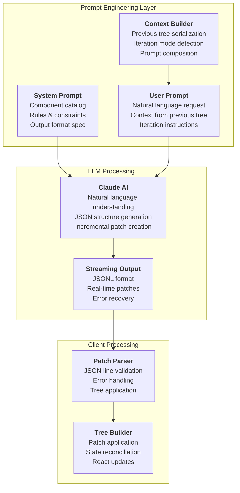
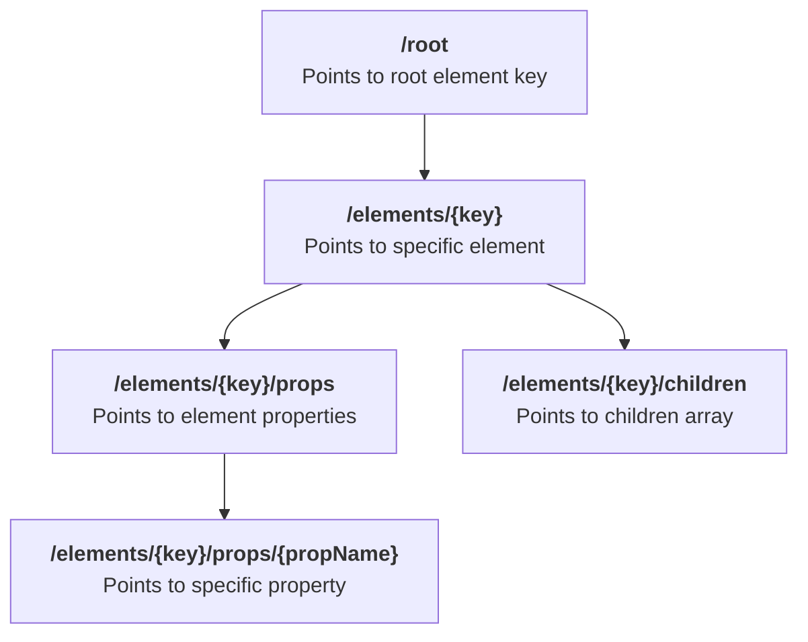
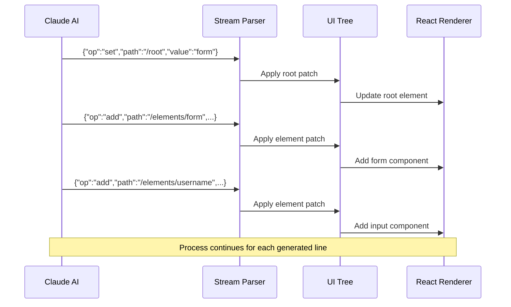

# Prompt Engineering & LLM Interaction

## Overview

The AI JSON Render system relies on sophisticated prompt engineering to guide large language models (LLMs) in generating structured UI components through JSON patches. This document explains how the system translates natural language requests into executable UI updates using carefully crafted prompts and streaming JSON Lines (JSONL) output.

## System Architecture for LLM Integration



## System Prompt Engineering

### Component Catalog Definition

The system prompt begins with a comprehensive catalog of available components:

```typescript
// From apps/web/app/api/generate/route.ts:7-48
const SYSTEM_PROMPT = `You are a UI generator that outputs JSONL (JSON Lines) patches.

AVAILABLE COMPONENTS (22):

Layout:
- Card: { title?: string, description?: string, maxWidth?: "sm"|"md"|"lg"|"full", centered?: boolean } - Container card for content sections. Has children. Use for forms/content boxes, NOT for page headers.
- Stack: { direction?: "horizontal"|"vertical", gap?: "sm"|"md"|"lg" } - Flex container. Has children.
- Grid: { columns?: 2|3|4, gap?: "sm"|"md"|"lg" } - Grid layout. Has children. ALWAYS use mobile-first: set columns:1 and use className for larger screens.
...`;
```

**Key prompt engineering principles:**

1. **Precise Component Descriptions**: Each component includes exact prop interfaces with TypeScript-like syntax
2. **Contextual Usage Guidance**: Components include specific use cases and constraints
3. **Hierarchical Organization**: Components are grouped by category (Layout, Form Inputs, Actions, etc.)
4. **Anti-patterns**: Explicit "DO NOT" instructions prevent common mistakes

### Output Format Specification

The prompt includes detailed JSONL format requirements:

```typescript
OUTPUT FORMAT (JSONL):
{"op":"set","path":"/root","value":"element-key"}
{"op":"add","path":"/elements/key","value":{"key":"...","type":"...","props":{...},"children":[...]}}

ALL COMPONENTS support: className?: string[] - array of Tailwind classes for custom styling
```

**Format constraints:**
- **Line-by-line parsing**: Each line must be valid JSON
- **Patch-based updates**: All changes expressed as RFC 6902-inspired patches
- **Key-based references**: Children use string keys, not nested objects
- **Type safety**: Component types must match registry entries

### Design Rules & Constraints

The system prompt includes critical design rules:

```typescript
RULES:
1. First line sets /root to root element key
2. Add elements with /elements/{key}
3. Children array contains string keys, not objects
4. Parent first, then children
5. Each element needs: key, type, props
6. Use className for custom Tailwind styling when needed

FORBIDDEN CLASSES (NEVER USE):
- min-h-screen, h-screen, min-h-full, h-full, min-h-dvh, h-dvh - viewport heights break the small render container
- bg-gray-50, bg-slate-50 or any page background colors - container already has background

MOBILE-FIRST RESPONSIVE:
- ALWAYS design mobile-first. Single column on mobile, expand on larger screens.
- Grid: Use columns:1 prop, add className:["sm:grid-cols-2"] or ["md:grid-cols-3"] for larger screens
```

**Constraint categories:**
1. **Structural Rules**: Ensure valid tree hierarchy
2. **Technical Constraints**: Prevent rendering issues
3. **Design Guidelines**: Enforce responsive best practices
4. **Performance Considerations**: Avoid expensive operations

## User Prompt Construction

### Initial Generation Mode

For new UI generation, the user prompt is straightforward:

```typescript
// From apps/web/app/api/generate/route.ts:68-70
let userPrompt = sanitizedPrompt;
// Example: "Create a login form"
```

**Characteristics:**
- Direct natural language request
- No existing context
- Full UI generation expected
- Complete component tree creation

### Iteration Mode

When modifying existing UI, the prompt includes current state context:

```typescript
// From apps/web/app/api/generate/route.ts:71-107
if (
  previousTree &&
  previousTree.root &&
  Object.keys(previousTree.elements || {}).length > 0
) {
  userPrompt = `CURRENT UI STATE (already loaded, DO NOT recreate existing elements):
${JSON.stringify(previousTree, null, 2)}

USER REQUEST: ${sanitizedPrompt}

IMPORTANT: The current UI is already loaded. Output ONLY the patches needed to make the requested change:
- To add a new element: {"op":"add","path":"/elements/new-key","value":{...}}
- To modify an existing element: {"op":"set","path":"/elements/existing-key","value":{...}}
- To update the root: {"op":"set","path":"/root","value":"new-root-key"}
- To add children: update the parent element with new children array

DO NOT output patches for elements that don't need to change. Only output what's necessary for the requested modification.`;
}
```

**Iteration prompt structure:**
1. **Current State Serialization**: Complete tree as JSON for LLM context
2. **Clear Instructions**: Explicit guidance on incremental updates only
3. **Patch Examples**: Concrete syntax for different update types
4. **Efficiency Emphasis**: Minimize unnecessary changes

## JSON Patch System for LLMs

### Patch Operation Types

The system uses four primary patch operations:

#### 1. Set Root Element
```json
{"op":"set","path":"/root","value":"login-form"}
```
**Purpose**: Establishes the top-level component key
**LLM Interpretation**: "Make this element the root of the UI tree"

#### 2. Add New Element
```json
{
  "op":"add",
  "path":"/elements/login-form",
  "value":{
    "key":"login-form",
    "type":"Card",
    "props":{"title":"Login","maxWidth":"sm","centered":true},
    "children":["username","password","submit"]
  }
}
```
**Purpose**: Creates a new UI element with all properties
**LLM Interpretation**: "Create a new component with these exact specifications"

#### 3. Modify Existing Element
```json
{"op":"set","path":"/elements/login-form/props/title","value":"Sign In"}
```
**Purpose**: Updates specific properties of existing elements
**LLM Interpretation**: "Change only this property, leave everything else unchanged"

#### 4. Remove Element
```json
{"op":"remove","path":"/elements/old-button"}
```
**Purpose**: Removes elements from the tree
**LLM Interpretation**: "Delete this component completely"

### Path Conventions

The system uses structured JSON Pointer paths:



**Path examples:**
- `/root` - Root element key
- `/elements/header` - Header element
- `/elements/header/props/title` - Header title property
- `/elements/form/children` - Form's children array

### LLM Interpretation Patterns

#### Hierarchical Construction

The LLM follows a consistent pattern for building UI hierarchies:

```json
{"op":"set","path":"/root","value":"page"}
{"op":"add","path":"/elements/page","value":{"key":"page","type":"Stack","props":{"direction":"vertical","gap":"lg"},"children":["header","content"]}}
{"op":"add","path":"/elements/header","value":{"key":"header","type":"Heading","props":{"text":"Welcome","level":1}}}
{"op":"add","path":"/elements/content","value":{"key":"content","type":"Text","props":{"content":"Page content"}}}
```

**Pattern analysis:**
1. **Root First**: Always establish root element
2. **Parent Before Children**: Create containers before contents
3. **Reference Consistency**: Child keys must match element keys
4. **Type Safety**: Component types must exist in catalog

#### Incremental Updates

For modifications, the LLM generates minimal patches:

```json
// Adding a new button to existing form
{"op":"add","path":"/elements/forgot-link","value":{"key":"forgot-link","type":"Link","props":{"label":"Forgot Password?","href":"/forgot"}}}
{"op":"set","path":"/elements/login-form/children","value":["username","password","submit","forgot-link"]}
```

**Update strategy:**
1. **Create New Elements**: Add only what's needed
2. **Update References**: Modify parent children arrays
3. **Preserve Existing**: Don't recreate unchanged elements
4. **Atomic Operations**: Each patch is self-contained

## Streaming JSONL Processing

### Real-time Patch Application

The system processes JSONL output line by line:



### Error Handling in Streaming

The parser handles malformed JSON gracefully:

```typescript
// From packages/react/src/hooks.ts:15-24
function parsePatchLine(line: string): JsonPatch | null {
  try {
    const trimmed = line.trim();
    if (!trimmed || trimmed.startsWith("//")) {
      return null; // Skip empty lines and comments
    }
    return JSON.parse(trimmed) as JsonPatch;
  } catch {
    return null; // Skip invalid JSON lines
  }
}
```

**Error recovery strategies:**
1. **Skip Invalid Lines**: Continue processing valid patches
2. **Comment Support**: Allow // comments for debugging
3. **Graceful Degradation**: Partial updates better than failure
4. **User Feedback**: Log parsing errors for development

## LLM Reasoning Patterns

### Component Selection Logic

The LLM uses contextual reasoning for component choice:

**User Request**: "Create a login form"
**LLM Reasoning**:
1. Form requires input fields → Select `Input` components
2. Form needs submission → Select `Button` component  
3. Form needs grouping → Select `Card` container
4. Layout needs structure → Select `Stack` for vertical arrangement

**Generated Output**:
```json
{"op":"set","path":"/root","value":"login"}
{"op":"add","path":"/elements/login","value":{"key":"login","type":"Card","props":{"title":"Login","maxWidth":"sm","centered":true},"children":["form"]}}
{"op":"add","path":"/elements/form","value":{"key":"form","type":"Stack","props":{"direction":"vertical","gap":"md"},"children":["username","password","submit"]}}
...
```

### Responsive Design Interpretation

The LLM applies mobile-first principles:

**User Request**: "Create a product grid"
**LLM Reasoning**:
1. Grid layout needed → Select `Grid` component
2. Mobile-first required → Set `columns:1`
3. Responsive scaling → Add `className:["sm:grid-cols-2","lg:grid-cols-3"]`
4. Content structure → Use `Card` components for products

### Context-Aware Iteration

When modifying existing UI, the LLM analyzes current state:

**Current State**: Login form with username/password
**User Request**: "Add a forgot password link"
**LLM Reasoning**:
1. Analyze existing structure → Identify form container
2. Determine insertion point → After submit button
3. Create minimal patch → Add link element only
4. Update references → Modify parent children array

## Advanced Prompt Techniques

### Example-Driven Learning

The system prompt includes concrete examples:

```typescript
EXAMPLE (Blog with responsive grid):
{"op":"set","path":"/root","value":"page"}
{"op":"add","path":"/elements/page","value":{"key":"page","type":"Stack","props":{"direction":"vertical","gap":"lg"},"children":["header","posts"]}}
{"op":"add","path":"/elements/header","value":{"key":"header","type":"Stack","props":{"direction":"vertical","gap":"sm"},"children":["title","desc"]}}
...
```

**Example benefits:**
1. **Concrete Reference**: Shows exact output format
2. **Pattern Demonstration**: Illustrates hierarchical construction
3. **Best Practices**: Demonstrates responsive design
4. **Error Prevention**: Reduces common mistakes

### Constraint Enforcement

The prompt uses multiple constraint mechanisms:

```typescript
FORBIDDEN CLASSES (NEVER USE):
- min-h-screen, h-screen, min-h-full, h-full, min-h-dvh, h-dvh - viewport heights break the small render container
- bg-gray-50, bg-slate-50 or any page background colors - container already has background
```

**Constraint types:**
1. **Negative Examples**: Explicit forbidden patterns
2. **Contextual Guidance**: Explain why constraints exist
3. **Alternative Suggestions**: Recommend better approaches
4. **Technical Justification**: Link constraints to system requirements

### Context Window Management

For iteration mode, the system manages context efficiently:

```typescript
// From apps/web/app/api/generate/route.ts:74-75
userPrompt = `CURRENT UI STATE (already loaded, DO NOT recreate existing elements):
${JSON.stringify(previousTree, null, 2)}`;
```

**Context strategies:**
1. **Full State Serialization**: Complete tree for LLM understanding
2. **Clear Boundaries**: Separate current state from user request
3. **Instruction Repetition**: Reinforce patch-only generation
4. **Optimization Hints**: Guide LLM toward efficient updates

## Performance Considerations

### Token Efficiency

The prompt engineering optimizes for token usage:

1. **Compact Descriptions**: Concise but complete component specs
2. **Structured Format**: Predictable JSON schema
3. **Minimal Redundancy**: Avoid repeating information
4. **Context Pruning**: Only include necessary state information

### Generation Speed

Design choices that improve generation latency:

1. **Streaming Output**: JSONL enables real-time updates
2. **Incremental Patches**: Minimal change sets
3. **Early Root Setting**: Enables immediate rendering start
4. **Error Recovery**: Skip invalid lines, continue processing

### Quality Assurance

Prompt techniques that improve output quality:

1. **Multiple Constraints**: Redundant guidance prevents errors
2. **Example Patterns**: Concrete templates to follow
3. **Context Awareness**: Previous tree understanding
4. **Iterative Refinement**: Support for modification requests

## Debugging & Development

### Prompt Testing

Strategies for improving prompt effectiveness:

```typescript
// Development approach for testing prompts
const testPrompts = [
  "Create a simple login form",
  "Add a forgot password link", 
  "Make the form responsive",
  "Change the submit button to red"
];

// Analyze LLM outputs for:
// 1. Correct JSONL format
// 2. Valid component types  
// 3. Proper patch operations
// 4. Responsive design patterns
```

### Common Issues & Solutions

| Issue | Cause | Solution |
|-------|-------|----------|
| Invalid JSON | Missing quotes/commas | Add format validation examples |
| Wrong component types | Unclear component catalog | Improve component descriptions |
| Missing children references | Incomplete hierarchy | Emphasize parent-child rules |
| Non-responsive design | Ignoring mobile-first | Strengthen responsive guidance |
| Excessive patches | Not understanding iteration | Clarify minimal update approach |

### Monitoring & Analytics

Key metrics for prompt effectiveness:

1. **Parse Success Rate**: Percentage of valid JSON lines
2. **Component Accuracy**: Correct component type selection
3. **Patch Efficiency**: Minimal changes for iterations
4. **Design Quality**: Responsive and accessible output
5. **Error Recovery**: Graceful handling of edge cases

## Future Enhancements

### Advanced Prompt Techniques

Potential improvements to the prompt engineering:

1. **Dynamic Component Catalog**: Adjust available components based on request context
2. **Style System Integration**: Include design system tokens in prompts
3. **Accessibility Guidance**: Add WCAG compliance instructions
4. **Performance Hints**: Include rendering optimization suggestions
5. **A/B Testing Framework**: Experiment with different prompt variations

### LLM Capability Evolution

Adaptations for future model improvements:

1. **Larger Context Windows**: Include more comprehensive state
2. **Function Calling**: Direct API integration for complex operations
3. **Multi-modal Input**: Support for image-to-UI generation
4. **Code Generation**: Output React components directly
5. **Interactive Planning**: Multi-turn UI design conversations

## Conclusion

The AI JSON Render system's prompt engineering creates a sophisticated bridge between natural language and structured UI generation. Through careful system prompt design, context management, and streaming patch application, the system enables real-time, iterative UI development guided by AI.

The key innovations include:

- **Structured Component Catalog**: Type-safe component descriptions for LLM understanding
- **Patch-Based Updates**: Efficient incremental modifications using JSON patches  
- **Context-Aware Iteration**: Previous state inclusion for intelligent modifications
- **Streaming Processing**: Real-time UI updates during generation
- **Error Recovery**: Graceful handling of malformed output

This architecture demonstrates how prompt engineering can create powerful developer tools that bridge the gap between AI capabilities and practical software development workflows.